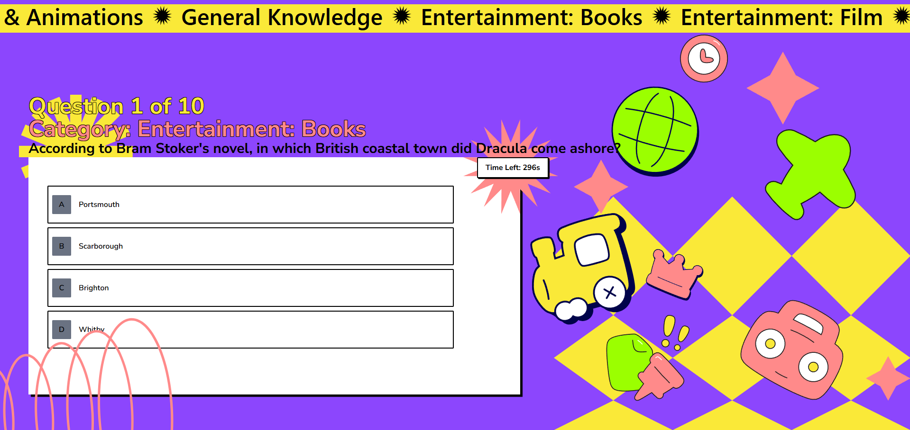

# Kuis App (Quiz App)

This project is a quiz application developed as part of an intern application for DOT Indonesia.

## Screenshots

Here's a look at the application in action:

<table>
  <tr>
    <td align="center">
      
    </td>
    <td align="center">
      
    </td>
  </tr>
  <tr>
    <td align="center">
      
    </td>
    <td align="center">
      
    </td>
  </tr>
</table>

## Technology Stack

The project is built using the following technologies:

* **[React](https://reactjs.org/)** - A JavaScript library for building user interfaces.
* **[TypeScript](https://www.typescriptlang.org/)** - A typed superset of JavaScript that compiles to plain JavaScript.
* **[Vite](https://vitejs.dev/)** - A modern frontend build tool that provides a faster and leaner development experience.
* **CSS** - For styling the application.

## Getting Started

Follow these instructions to get a copy of the project up and running on your local machine for development and testing purposes.

### Prerequisites

You must have [Node.js](https://nodejs.org/) (which includes npm) installed on your computer.

### Installation & Running

1.  **Clone the repository:**
    ```sh
    git clone [https://github.com/ExelAlfanso/kuis-app.git](https://github.com/ExelAlfanso/kuis-app.git)
    ```
2.  **Navigate to the project directory:**
    ```sh
    cd kuis-app
    ```
3.  **Install the dependencies:**
    ```sh
    npm install
    ```
4.  **Run the development server:**
    ```sh
    npm run dev
    ```
    Open [http://localhost:5173](http://localhost:5173) (or the port shown in your terminal) to view the app in your browser.
